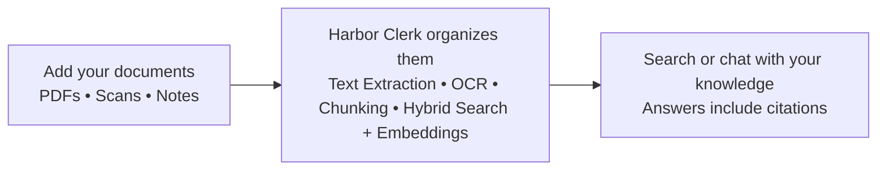
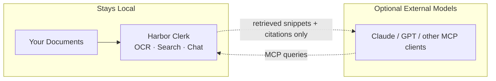

<p align="center">
  
</p>

# Harbor Clerk

### Keep your data. Ask it anything.

Local-first document knowledge base with OCR, hybrid search, and chat.
Drop in PDFs, scans, notes, or research files — Harbor Clerk turns them into a private corpus you can search, explore, and query with local or external LLMs.


---

Harbor Clerk is a safe harbor for your documents — and a capable clerk who knows where everything is. Drop in PDFs, scans, notes, contracts, or research files, and Harbor Clerk turns them into a searchable knowledge base you can actually talk to.

It reads your files, extracts text (including OCR for scanned documents), splits them into searchable passages, and indexes everything locally so you can search or ask questions across your entire collection. Results always come with clear citations so you can jump straight back to the original document and verify the source.

Everything runs on your machine. No SaaS account. No background sync. No shared tenancy. Your documents stay local.

Harbor Clerk is designed for small offices, independent operators, and privacy-focused individuals. It runs comfortably on a Mac mini or similar hardware and includes a built-in chat assistant powered by a local LLM.

If you want to connect external AI tools, Harbor Clerk exposes an MCP endpoint that allows them to search your knowledge base safely. They receive only the retrieved passages needed to answer a question — never your full documents.

This isn't a platform. It's a tool.
It keeps your documents where they belong — and makes them useful.

## How Harbor Clerk Works



## Privacy Boundary

External models can ask questions — they don't get your archive.



## Why Harbor Clerk?

**Your documents stay private**
Everything runs locally. No uploads to SaaS services, no background syncing, and no shared infrastructure.

**Your files become searchable knowledge**
Harbor Clerk reads documents, performs OCR when needed, builds hybrid full-text and semantic search, and lets you explore everything through search or chat — always with citations.

**Use any model you trust**
Chat locally with built-in models, or connect external AI tools through MCP. They see only the passages needed to answer a question — never your full corpus.

## Quick Start (Mac)

1. Download Harbor Clerk from the [releases page](https://github.com/r0shi/harborclerk/releases)
2. Launch **Harbor Clerk Server**
3. Open **Harbor Clerk**
4. Drop in a few PDFs and start asking questions

That's it — everything runs locally.

## Quick Start (Docker)

```bash
git clone https://github.com/r0shi/harborclerk.git
cd harborclerk
cp .env.example .env
docker compose up --build
```

Then open https://localhost

## Who Harbor Clerk Is For

- Small offices without a formal knowledge base
- Researchers with large document collections
- Consultants, lawyers, and analysts managing private files
- Anyone who wants LLM-style document search without uploading data to the cloud

## Philosophy

Harbor Clerk follows a simple rule:

**Documents stay local. Models come and go.**

Your corpus should live on infrastructure you control.
AI models — local or cloud — should interact with it through well-defined interfaces.

Harbor Clerk is designed to be:

- **Local-first** — your data never has to leave your machine
- **Model-agnostic** — use local models, cloud models, or both
- **Transparent** — answers always cite their sources
- **Simple to operate** — runs comfortably on a single small machine

---

## Deployment Options

Harbor Clerk can run in two ways:

| | macOS Native | Docker Compose |
|---|---|---|
| **Best for** | Target audience — small offices with a Mac | DIY / Linux servers |
| **Services** | Managed by menubar app as subprocesses | Eight Docker containers |
| **Storage** | Local filesystem (`~/Library/Application Support/Harbor Clerk/`) | MinIO object storage + Docker volumes |
| **HTTPS** | Direct localhost access | Caddy reverse proxy with self-signed cert |

### macOS Native App

**Requirements:** Mac mini M2 or newer (M1 works, M2+ recommended), macOS 15.0+, 16 GB RAM minimum.

All data lives in `~/Library/Application Support/Harbor Clerk/` — PostgreSQL database, uploaded files, downloaded LLM models, logs, and settings.

Open Preferences (Cmd+,) from the menubar to configure network access, worker preset, ports, and log level.

### Docker Compose

**Requirements:** Docker Desktop or Docker Engine + Compose, 4 GB RAM minimum (8 GB recommended).

Edit `.env` and change `SECRET_KEY` to a random string before starting:

```bash
python3 -c "import secrets; print(secrets.token_urlsafe(48))"
```

Open **https://localhost/** and accept the self-signed certificate. Create your admin account on the setup page.

| Variable | Default | Description |
|---|---|---|
| `SECRET_KEY` | `change-me-in-production` | JWT signing key — **change this** |
| `DATABASE_URL` | `postgresql+asyncpg://harbor_clerk:...` | PostgreSQL connection string |
| `MINIO_ENDPOINT` | `minio:9000` | MinIO endpoint |
| `MINIO_ACCESS_KEY` | `minioadmin` | MinIO access key |
| `MINIO_SECRET_KEY` | `minioadmin123` | MinIO secret key |
| `LOG_LEVEL` | `INFO` | Logging level |

```bash
docker compose up --build         # build and start (foreground)
docker compose up --build -d      # build and start (background)
docker compose down               # stop (keeps data)
docker compose down -v            # stop and delete all data
docker compose logs -f app        # tail app logs
```

**Services:** gateway (Caddy), app (FastAPI + React SPA), worker-io, worker-cpu, embedder (all-MiniLM-L6-v2), postgres (pgvector + pg_trgm), minio, tika.

---

## Architecture

### Ingestion Pipeline

Upload a file and it goes through seven idempotent stages:

1. **Extract** — pull text from PDF, Office, eBook, HTML, email, and other formats via Apache Tika (TXT/MD/CSV decoded directly)
2. **OCR** — conditional: always for images (JPEG/PNG/TIFF), for PDFs with little extractable text; never for text-native formats. Uses Tesseract (English + French)
3. **Chunk** — split into ~1000 character segments with 150 char overlap, preserving page references and detecting language per chunk
4. **Entities** — extract named entities (people, places, organizations) via spaCy NER (English + French models)
5. **Embed** — generate 384-dim vectors via the embedder service
6. **Summarize** — generate a document summary (local LLM, with extractive fallback)
7. **Finalize** — mark ingestion complete

Progress is streamed to the UI via server-sent events with a visual stage ring showing each step. Processing can be cancelled from the admin UI.

### Hybrid Search

Results combine PostgreSQL full-text search (bilingual English/French) and pgvector cosine similarity, merged and ranked with boosts for latest document versions and higher OCR confidence. All results include source citations with page numbers. Search supports filtering by document, date range, language, and MIME type, with faceted results grouping hits by document.

### Local Chat

A built-in chat assistant runs a local LLM (via llama-server) with access to the knowledge base through tool calls. Models can be downloaded and managed from the admin UI. No data leaves the machine.

Chat automatically retrieves relevant passages from your documents (RAG) and displays them as a collapsible context card above each response — click any source to jump to the original document. The assistant can also use tools to search, read passages, and explore document structure during the conversation.

### Document Intelligence

Beyond basic search, Harbor Clerk builds a navigable knowledge graph:

- **Document outlines** — heading structure extracted during ingestion
- **Entity index** — people, places, and organizations extracted by spaCy, searchable and browsable
- **Cross-document similarity** — find related documents using embedding-based nearest neighbors
- **Corpus overview** — aggregate stats (language distribution, MIME types, page counts, date ranges)
- **Stats dashboard** — visual corpus analytics: language/file type/OCR charts, pipeline timing, entity co-occurrence network (d3-force), and UMAP document cluster map

### Auth

- **Human users**: email + password, JWT access tokens + refresh cookies. Roles: `admin` / `user`.
- **API keys**: admin-created, read-only, for MCP clients. Stored as SHA-256 hashes.

---

## API

### REST

| Endpoint | Method | Description |
|---|---|---|
| `/api/auth/login` | POST | Login (email + password) |
| `/api/auth/refresh` | POST | Refresh access token |
| `/api/system/setup-status` | GET | Check if first-time setup is needed |
| `/api/setup` | POST | Create initial admin account |
| `/api/uploads` | POST | Upload documents |
| `/api/uploads/confirm` | POST | Confirm upload action |
| `/api/uploads/confirm-batch` | POST | Confirm multiple uploads |
| `/api/docs` | GET | List documents |
| `/api/docs/overview` | GET | Corpus overview stats |
| `/api/docs/{id}` | GET | Document detail with versions |
| `/api/docs/{id}/content` | GET | Read document text (with page ranges) |
| `/api/docs/{id}/outline` | GET | Document heading structure |
| `/api/docs/{id}/entities` | GET | Named entities in document |
| `/api/docs/{id}/related` | GET | Similar documents |
| `/api/docs/{id}/download` | GET | Download original file |
| `/api/docs/{id}` | DELETE | Soft-delete a document |
| `/api/docs/{id}/reprocess` | POST | Re-run ingestion |
| `/api/docs/{id}/cancel` | POST | Cancel in-progress ingestion |
| `/api/stats` | GET | Corpus-level aggregate statistics |
| `/api/stats/clusters` | GET | Document centroid embeddings for UMAP clustering |
| `/api/stats/entity-network` | GET | Entity co-occurrence network graph |
| `/api/docs/{id}/stats` | GET | Per-document statistics |
| `/api/search` | POST | Hybrid search (with optional filtering and facets) |
| `/api/passages/read` | POST | Read passages by chunk IDs |
| `/api/chat/conversations` | GET/POST | List or create chat conversations |
| `/api/chat/conversations/{id}/messages` | POST | Send a message (streamed response with RAG) |
| `/api/chat/models` | GET | List available LLM models |
| `/api/chat/models/{id}/download` | POST | Download a model |
| `/api/system/health` | GET | Health check |
| `/api/system/stats` | GET | System performance stats (admin) |
| `/api/system/retrieval-settings` | GET/PUT | RAG and MCP retrieval config (admin) |
| `/api/system/reprocess-all` | POST | Re-run ingestion on all documents (admin) |
| `/api/system/resummarize-all` | POST | Re-run summaries on all documents (admin) |
| `/api/system/delete-all-documents` | POST | Delete all documents and data (admin) |
| `/api/jobs/stream` | GET | SSE stream of job progress |

### MCP

`POST /mcp` — Streamable HTTP transport. Authenticate with `Authorization: Bearer <api_key>`.

| Tool | Description |
|---|---|
| `kb_search` | Hybrid search with pagination, detail modes, and optional filters |
| `kb_read_passages` | Read specific passages by chunk ID |
| `kb_expand_context` | Get surrounding chunks for a given chunk |
| `kb_get_document` | Document metadata, versions, and summary |
| `kb_list_recent` | Recently added documents with summaries |
| `kb_corpus_overview` | Aggregate corpus stats (languages, types, dates) |
| `kb_document_outline` | Document heading structure and page layout |
| `kb_find_related` | Find similar documents via embedding similarity |
| `kb_entity_search` | Search named entities across the corpus |
| `kb_entity_overview` | Entity type breakdown (per-doc or corpus-wide) |
| `kb_entity_cooccurrence` | Find entities that co-occur in the same chunk or document |
| `kb_read_document` | Read full document text or a page range |
| `kb_batch_search` | Run up to 5 search queries in a single call |
| `kb_ingest_status` | Check ingestion progress |
| `kb_reprocess` | Re-run ingestion on a document |
| `kb_system_health` | System health check |

---

## Building from Source

### macOS Native Apps

```bash
cd macos
make all
```

This builds both apps into `macos/build/output/`. Requires Xcode command-line tools, Python 3.12+, and Homebrew (for Tesseract).

### Frontend

```bash
cd frontend
npm install
npm run dev     # dev server with HMR
npm run build   # production build → dist/
```

### Python Backend

The project uses [uv](https://docs.astral.sh/uv/) for Python package management:

```bash
uv sync
uv run harbor-clerk-api      # API server
uv run harbor-clerk-worker   # background worker
```

---

## License

MIT — see [LICENSE](LICENSE) for details. Third-party dependencies are listed in [THIRD_PARTY_NOTICES.md](THIRD_PARTY_NOTICES.md).
