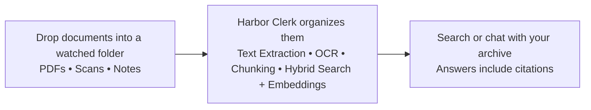
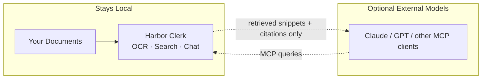

<p align="center">
  
</p>

# Harbor Clerk

### Keep your data. Ask it anything.

Local-first document archive for non-technical offices. Point Harbor Clerk at a folder of PDFs, scans, notes, or research files; it OCRs, indexes, and lets you search, browse, and chat with everything — all on your own machine, all with citations.


---

Harbor Clerk is a safe harbor for your documents — and a capable clerk who knows where everything is. Tell it which folders to watch — contracts, scans, research, anything — and Harbor Clerk continuously reads what lands there and turns it into a searchable archive you can actually talk to.

It reads your files in place, extracts text (including OCR for scanned documents), splits them into searchable passages, and indexes everything locally so you can search or ask questions across your entire collection. Results always come with clear citations so you can jump straight back to the original document and verify the source.

Everything runs on your machine. No SaaS account. No background sync. No shared tenancy. Your originals never move — Harbor Clerk just reads them where they live.

Harbor Clerk is designed for small offices, independent operators, and privacy-focused individuals. It runs comfortably on a Mac mini or similar hardware and includes a built-in chat assistant powered by a local LLM.

If you want to connect external AI tools, Harbor Clerk exposes an MCP endpoint that allows them to search your knowledge base safely. They receive only the retrieved passages needed to answer a question — never your full documents.

This isn't a platform. It's a tool.
It keeps your documents where they belong — and makes them useful.

## How Harbor Clerk Works


```mermaid
graph LR
    docs["Drop documents into a watched folder<br/>PDFs • Scans • Notes"]
    process["Harbor Clerk organizes them<br/>Text Extraction • OCR • Chunking • Hybrid Search + Embeddings"]
    ask["Search or chat with your archive<br/>Answers include citations"]
    docs --> process --> ask
```

## Privacy Boundary

External models can ask questions — they don't get your archive.


```mermaid
graph LR
    subgraph local["Stays Local"]
        docs["Your Documents"]
        harbor["Harbor Clerk<br/>OCR · Search · Chat"]
    end
    subgraph external["Optional External Models"]
        models["Claude / GPT / other MCP clients"]
    end
    docs --> harbor
    models -. "MCP queries" .-> harbor
    harbor -. "retrieved snippets + citations only" .-> models
```

## Why Harbor Clerk?

**Your documents stay private**
Everything runs locally. No uploads to SaaS services, no background syncing, and no shared infrastructure.

**Your files become searchable knowledge**
Harbor Clerk reads documents, performs OCR when needed, builds hybrid full-text and semantic search, and lets you explore everything through search or chat — always with citations.

**Use any model you trust**
Chat locally with built-in models, or connect external AI tools through MCP. They see only the passages needed to answer a question — never your full corpus.

## Quick Start (Mac)

1. Download Harbor Clerk from the [releases page](https://github.com/r0shi/harborclerk/releases)
2. Launch **Harbor Clerk Server** (menubar app — starts all backend services)
3. Open **Harbor Clerk** (web UI inside a native window)
4. Click **Folders → Add Folder**, pick a directory full of documents, and let ingestion run
5. Ask questions, browse the corpus, or kick off a deep research task

That's it — everything runs locally.

## Quick Start (Docker)

```bash
git clone https://github.com/r0shi/harborclerk.git
cd harborclerk
cp .env.example .env
mkdir -p data/watch/inbox       # any subdirectory of ./data/watch becomes a watched folder
docker compose up --build
```

Then open https://localhost, accept the self-signed certificate, and create your admin account. Drop documents into `./data/watch/inbox/` (or any subdirectory of `./data/watch/`) and they'll start ingesting within ~60 seconds. See [docs/watched-folders-docker.md](docs/watched-folders-docker.md) for mounting external paths and other operator details.

## Who Harbor Clerk Is For

- Small offices without a formal knowledge base
- Researchers with large document collections
- Consultants, lawyers, and analysts managing private files
- Anyone who wants LLM-style document search without uploading data to the cloud

## Philosophy

Harbor Clerk follows a simple rule:

**Documents stay local. Models come and go.**

Your corpus should live on infrastructure you control.
AI models — local or cloud — should interact with it through well-defined interfaces.

Harbor Clerk is designed to be:

- **Local-first** — your data never has to leave your machine
- **Model-agnostic** — use local models, cloud models, or both
- **Transparent** — answers always cite their sources
- **Simple to operate** — runs comfortably on a single small machine

---

## Deployment Options

Harbor Clerk can run in two ways:

| | macOS Native | Docker Compose |
|---|---|---|
| **Best for** | Target audience — small offices with a Mac | DIY / Linux servers |
| **Services** | Managed by menubar app as subprocesses | Ten Docker containers |
| **Folder picker** | Native folder picker in the UI | Operator mounts host paths into the watcher container |
| **Originals** | Read in place from your filesystem | Read in place from bind-mounted volumes |
| **HTTPS** | Direct localhost access | Caddy reverse proxy with self-signed cert |

Both deployments use the same Python `watchdog`-based watcher under the hood (FSEvents on macOS, inotify on Linux, polling fallback for NFS/SMB/fuse mounts).

### macOS Native App

**Requirements:** Mac mini M2 or newer (M1 works, M2+ recommended), macOS 15.0+, 16 GB RAM minimum.

App data lives in `~/Library/Application Support/Harbor Clerk/` — PostgreSQL database, downloaded LLM models, logs, and settings. **Your source documents stay where you put them**; Harbor Clerk only references them by path.

Open Preferences (Cmd+,) from the menubar to configure network access, worker preset, ports, and log level. Manage watched folders from the **Folders** tab in the web UI — the native folder picker dialog walks you through picking a directory, and macOS bookmark data keeps it tracked across renames and moves.

### Docker Compose

**Requirements:** Docker Desktop or Docker Engine + Compose, 4 GB RAM minimum (8 GB recommended).

Edit `.env` and change `SECRET_KEY` to a random string before starting:

```bash
python3 -c "import secrets; print(secrets.token_urlsafe(48))"
```

Open **https://localhost/** and accept the self-signed certificate. Create your admin account on the setup page.

**Watched folders on Docker** are operator-controlled: the `watcher` service auto-discovers any top-level subdirectory of `WATCH_ROOT` (`/data/watch` inside the container, bind-mounted from `./data/watch` on the host) and ingests files dropped into it. There is no "Add Folder" button on Docker — you create directories, or mount external paths into `/data/watch/<name>`. See [docs/watched-folders-docker.md](docs/watched-folders-docker.md) for the full operator guide.

| Variable | Default | Description |
|---|---|---|
| `SECRET_KEY` | `change-me-in-production` | JWT signing key — **change this** |
| `DATABASE_URL` | `postgresql+asyncpg://harbor_clerk:...` | PostgreSQL connection string |
| `WATCH_ROOT` | `/data/watch` | Container path whose top-level subdirs become watched folders |
| `MINIO_ENDPOINT` | `minio:9000` | MinIO endpoint (currently used by legacy upload API; watched-folder originals are read in place from `./data/watch`) |
| `MINIO_ACCESS_KEY` | `minioadmin` | MinIO access key |
| `MINIO_SECRET_KEY` | `minioadmin123` | MinIO secret key |
| `ALLOW_SOURCE_DOWNLOAD` | `false` | Set `true` to expose `/api/docs/{id}/download` (see [Source files](#source-files-reveal-vs-download) below) |
| `LOG_LEVEL` | `INFO` | Logging level |

```bash
docker compose up --build         # build and start (foreground)
docker compose up --build -d      # build and start (background)
docker compose down               # stop (keeps data)
docker compose down -v            # stop and delete all data
docker compose logs -f app        # tail app logs
docker compose logs -f watcher    # see what the watcher is picking up
```

**Services:** `gateway` (Caddy), `app` (FastAPI + React SPA), `worker-io`, `worker-cpu`, `watcher` (folder watching + ingest queueing), `embedder` (multilingual-e5-small), `postgres` (pgvector + pg_trgm), `minio`, `tika`, `llama-server` (local LLM inference).

---

## Architecture

### Ingestion Pipeline

Drop a file into a watched folder and it flows through seven idempotent stages:

1. **Extract** — pull text from PDF, Office, eBook, HTML, email, and other formats via Apache Tika (TXT/MD/CSV decoded directly)
2. **OCR** — conditional: always for images (JPEG/PNG/TIFF), for PDFs with little extractable text; never for text-native formats. Uses Tesseract (English + French)
3. **Chunk** — split into ~1000 character segments with 150 char overlap, preserving page references and detecting language per chunk
4. **Entities** — extract named entities (people, places, organizations) via spaCy NER (English + French models)
5. **Embed** — generate 384-dim vectors via the embedder service
6. **Summarize** — generate a document summary (local LLM, with extractive fallback)
7. **Finalize** — mark ingestion complete

Progress is streamed to the UI via server-sent events with a visual stage ring showing each step. Processing can be cancelled from the admin UI. Renames, edits, and deletions in the watched folder propagate automatically — Harbor Clerk reprocesses the file or soft-deletes the document, and a 30-day reaper purges originals that stay missing.

### Source Files: Reveal vs Download

Because Harbor Clerk reads originals in place, getting back to the actual file on disk works differently in each deployment — and intentionally so:

| | macOS Native | Docker Compose |
|---|---|---|
| **Default action** | **Reveal in Finder** opens the original in its enclosing folder | No file-access action — users read passages and citations |
| **Download API** | Disabled by design; the menu app does not expose a way to enable it | Disabled by default; an admin opts in via `ALLOW_SOURCE_DOWNLOAD=true` |

On macOS, the document detail page shows a **Reveal in Finder** button that opens the file's enclosing folder via the native bridge — no HTTP, no bytes leaving the machine. On Docker the same button isn't available (no native bridge), and `GET /api/docs/{id}/download` returns 403 unless an admin sets `ALLOW_SOURCE_DOWNLOAD=true` in the compose env.

The reason the download endpoint is locked down by default: it returns the *raw bytes* of any document the caller can already see in search, which is a meaningful escalation over the chunk-excerpt access read-only API keys are designed for. Reveal in Finder sidesteps this entirely because it never touches the API.

### Hybrid Search

Results combine PostgreSQL full-text search (bilingual English/French) and pgvector cosine similarity, normalized and merged into a single score with a small boost for higher-confidence OCR text. All results include source citations with page numbers. Search supports filtering by document, date range, language, and MIME type, with faceted results grouping hits by document.

### Local Chat

A built-in chat assistant runs a local LLM (via llama-server) with access to the knowledge base through tool calls. Models can be downloaded and managed from the admin UI. No data leaves the machine.

The chat assistant uses tool calls to search, read passages, explore document structure, and query entities during the conversation. Results include source citations with page numbers so you can verify findings against the original documents.

### Deep Research

For complex questions that require systematically examining your corpus, Research mode runs an autonomous agent (powered by smolagents) that iterates through search, read, and entity tools — then synthesizes its findings into a cited report.

Configuration per task:
- **Strategy**: Search-driven (follows leads) or Systematic sweep (reviews every document)
- **Depth**: Light / Standard / Thorough (controls planning frequency)
- **Time limit**: 15 minutes to 3 hours

Research runs in the background with live progress streaming: elapsed time, tool-by-tool activity log, and research notes visibility. Results include the agent's raw findings and a polished synthesis report with citations.

### Document Intelligence

Beyond basic search, Harbor Clerk builds a navigable knowledge graph:

- **Document outlines** — heading structure extracted during ingestion
- **Entity index** — people, places, and organizations extracted by spaCy, searchable and browsable
- **Cross-document similarity** — find related documents using embedding-based nearest neighbors
- **Corpus overview** — aggregate stats (language distribution, MIME types, page counts, date ranges)
- **Topic modeling** — BERTopic-based clustering discovers themes across the corpus, surfaced in Observatory visualizations (treemap, bar chart, keywords, cluster map) and injected as context for chat
- **Stats dashboard** — visual corpus analytics: language/file type/OCR charts, pipeline timing, entity co-occurrence network (d3-force), UMAP document cluster map (colorable by topic), and topic distribution charts

### External LLM Connections

Connect ChatGPT, Claude Desktop, Claude Code, Gemini CLI, OpenClaw, or any MCP-compatible tool. ChatGPT connects via OAuth (requires a public URL); all others use API key authentication. Connection guides are available in the Integrations settings page.

**Scoped API keys** control what each external tool can access: permission tiers (search / read / full), document scope (by topic or watched folder), snippet size limits, tool overrides, and expiry dates.

**Rate limiting** (per-minute + per-hour) protects against runaway AI agents. System-wide defaults apply to all keys; per-key overrides available.

**Audit dashboard** provides full per-key introspection: request counts, tool breakdowns, error/denial/rate-limit tracking, and a filterable request log.

> **Security note for agentic tools (OpenClaw, etc.):** Autonomous AI agents can make many tool calls in rapid succession. Always create a dedicated, scoped API key with rate limits and an expiry date. Monitor usage via the per-key audit dashboard.

### Auth

- **Human users**: email + password, JWT access tokens + refresh cookies. Roles: `admin` / `user`.
- **API keys**: admin-created, read-only, scoped. Per-key permission tiers, document scope, rate limits, snippet caps, expiry. Stored as SHA-256 hashes.
- **OAuth 2.1**: Dynamic client registration for ChatGPT and other OAuth-based MCP clients.

---

## API

### REST

| Endpoint | Method | Description |
|---|---|---|
| `/api/auth/login` | POST | Login (email + password) |
| `/api/auth/refresh` | POST | Refresh access token |
| `/api/system/setup-status` | GET | Check if first-time setup is needed |
| `/api/setup` | POST | Create initial admin account |
| `/api/watch/system` | GET | Deployment context for the folder UI (`platform`, `picker`, `watch_root`) |
| `/api/watch/folders` | GET/POST | List or register watched folders (POST is macOS-only) |
| `/api/watch/folders/{id}` | PATCH/DELETE | Update or remove a watched folder |
| `/api/watch/folders/{id}/progress` | GET | Per-folder ingestion stats across all 7 stages |
| `/api/watch/folders/stream` | GET | SSE stream of per-folder progress deltas |
| `/api/watch/folders/{id}/rescan` | POST | Trigger a full rescan of a folder |
| `/api/docs` | GET | List documents |
| `/api/docs/overview` | GET | Corpus overview stats |
| `/api/docs/{id}` | GET | Document detail |
| `/api/docs/{id}/content` | GET | Read document text (with page ranges) |
| `/api/docs/{id}/outline` | GET | Document heading structure |
| `/api/docs/{id}/entities` | GET | Named entities in document |
| `/api/docs/{id}/related` | GET | Similar documents |
| `/api/docs/{id}/download` | GET | Download original file (gated by `ALLOW_SOURCE_DOWNLOAD`; see [Source Files](#source-files-reveal-vs-download)) |
| `/api/docs/{id}` | DELETE | Soft-delete a document |
| `/api/docs/{id}/reprocess` | POST | Re-run ingestion |
| `/api/docs/{id}/cancel` | POST | Cancel in-progress ingestion |
| `/api/stats` | GET | Corpus-level aggregate statistics |
| `/api/stats/clusters` | GET | Document centroid embeddings for UMAP clustering |
| `/api/stats/entity-network` | GET | Entity co-occurrence network graph |
| `/api/docs/{id}/stats` | GET | Per-document statistics |
| `/api/search` | POST | Hybrid search (with optional filtering and facets) |
| `/api/passages/read` | POST | Read passages by chunk IDs |
| `/api/chat/conversations` | GET/POST | List or create chat conversations |
| `/api/chat/conversations/{id}/messages` | POST | Send a message (streamed response with RAG) |
| `/api/chat/models` | GET | List available LLM models |
| `/api/chat/models/{id}/download` | POST | Download a model |
| `/api/research` | GET/POST | List research tasks / start new research (streamed) |
| `/api/research/active` | GET | Check if a research task is running |
| `/api/research/{id}` | GET/DELETE | Get research detail / delete task |
| `/api/research/{id}/resume` | POST | Resume interrupted research (streamed) |
| `/api/system/health` | GET | Health check |
| `/api/system/stats` | GET | System performance stats (admin) |
| `/api/system/retrieval-settings` | GET/PUT | RAG and MCP retrieval config (admin) |
| `/api/system/reprocess-all` | POST | Re-run ingestion on all documents (admin) |
| `/api/system/resummarize-all` | POST | Re-run summaries on all documents (admin) |
| `/api/system/delete-all-documents` | POST | Delete all documents and data (admin) |
| `/api/jobs/stream` | GET | SSE stream of job progress |

### MCP

`POST /mcp` — Streamable HTTP transport. Authenticate with `Authorization: Bearer <api_key>`.

| Tool | Description |
|---|---|
| `kb_search` | Hybrid search with pagination, detail modes, and optional filters |
| `kb_read_passages` | Read specific passages by chunk ID |
| `kb_expand_context` | Get surrounding chunks for a given chunk |
| `kb_get_document` | Document metadata and summary |
| `kb_list_recent` | Recently added documents with summaries |
| `kb_corpus_overview` | Aggregate corpus stats (languages, types, dates) |
| `kb_document_outline` | Document heading structure and page layout |
| `kb_find_related` | Find similar documents via embedding similarity |
| `kb_entity_search` | Search named entities across the corpus |
| `kb_entity_overview` | Entity type breakdown (per-doc or corpus-wide) |
| `kb_entity_cooccurrence` | Find entities that co-occur in the same chunk or document |
| `kb_read_document` | Read full document text or a page range |
| `kb_batch_search` | Run up to 5 search queries in a single call |
| `kb_ingest_status` | Check ingestion progress |
| `kb_reprocess` | Re-run ingestion on a document |
| `kb_system_health` | System health check |

---

## Building from Source

### macOS Native Apps

```bash
cd macos
make all
```

This builds both apps into `macos/build/output/`. Requires Xcode command-line tools, Python 3.12+, and Homebrew (for Tesseract).

### Frontend

```bash
cd frontend
npm install
npm run dev     # dev server with HMR
npm run build   # production build → dist/
```

### Python Backend

The project uses [uv](https://docs.astral.sh/uv/) for Python package management:

```bash
uv sync
uv run harbor-clerk-api      # API server
uv run harbor-clerk-worker   # background worker
```

---

## License

MIT — see [LICENSE](LICENSE) for details. Third-party dependencies are listed in [THIRD_PARTY_NOTICES.md](THIRD_PARTY_NOTICES.md).
