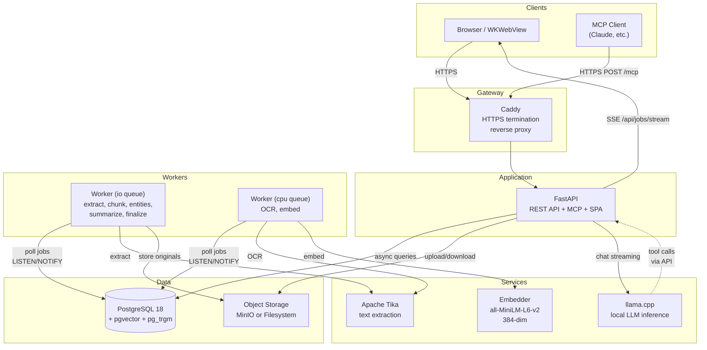
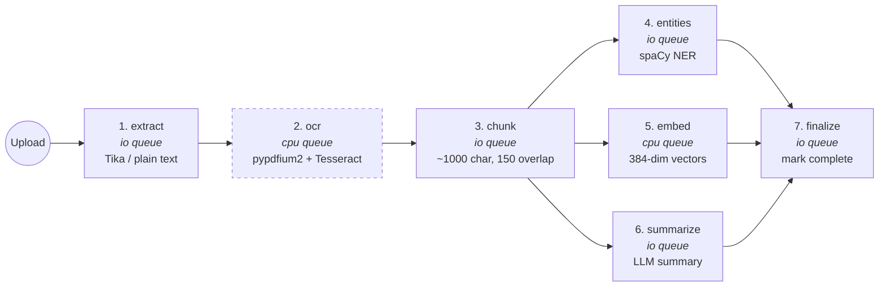
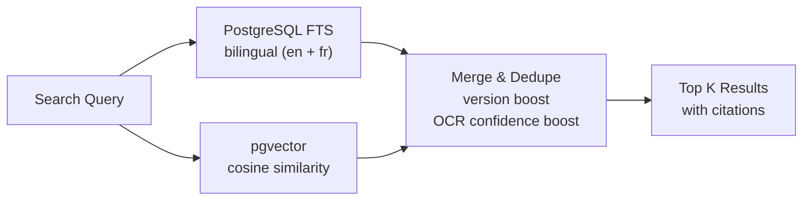
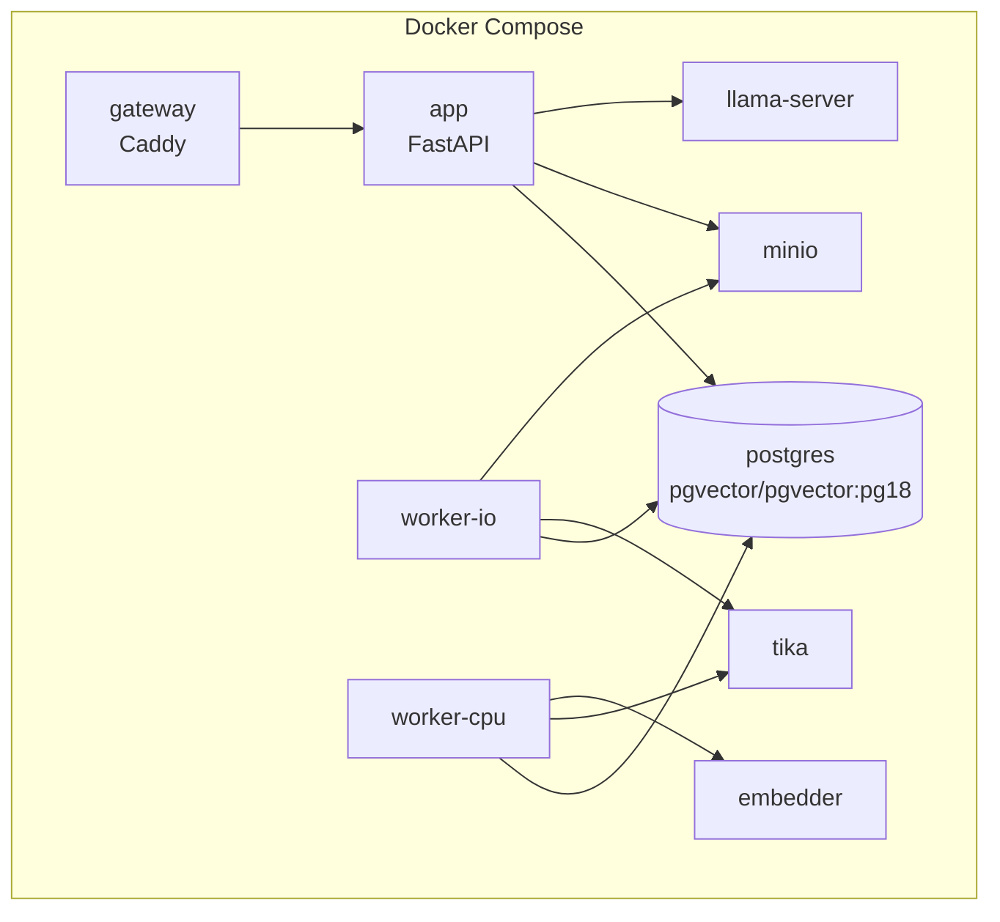
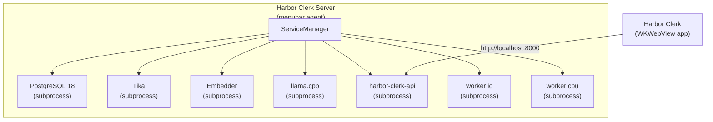
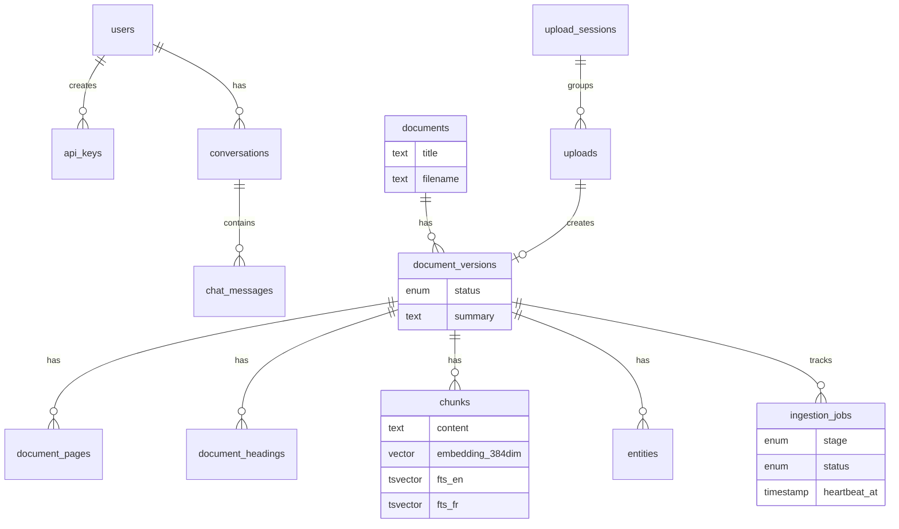
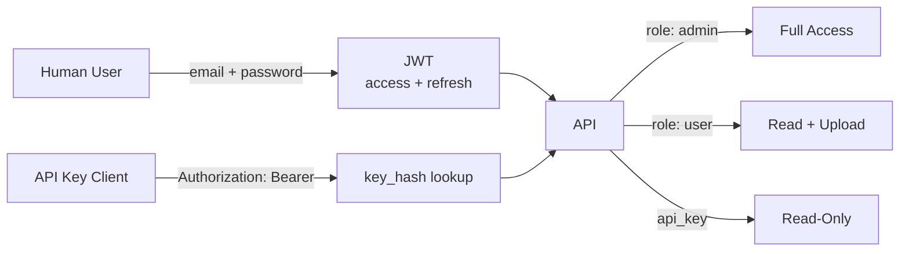

# Harbor Clerk Architecture

## System Overview

## Ingestion Pipeline

Seven idempotent stages, each guarded by row-level lock on `(version_id, stage)`:

> OCR (dashed) is conditional: always for images; PDF only if extracted text is sparse; skipped for text-native formats.

## Retrieval Flow

## Deployment Modes

### Docker Compose (Linux / DIY)

### macOS Native

## Data Model (key tables)

## Auth Model

