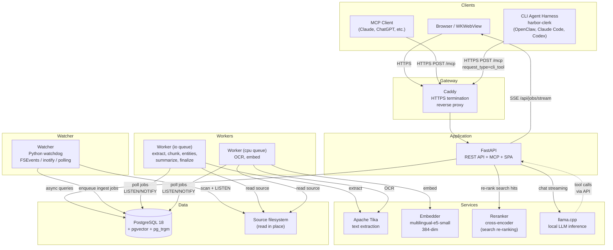
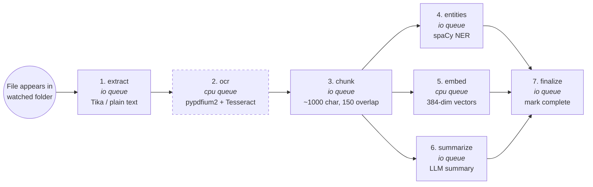
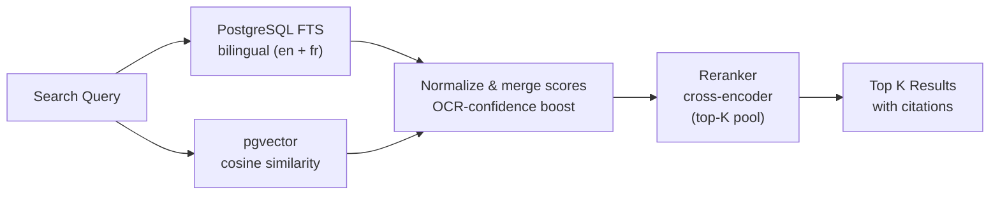
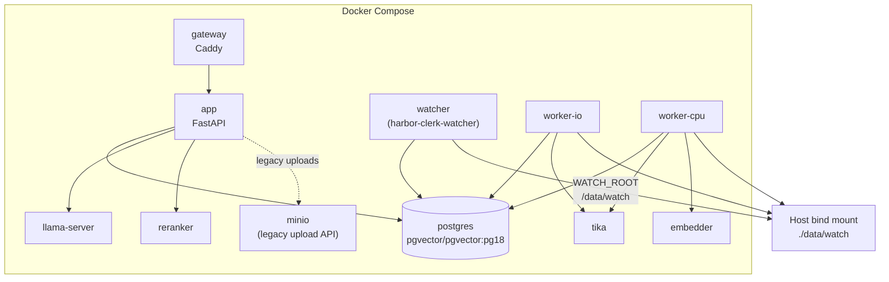
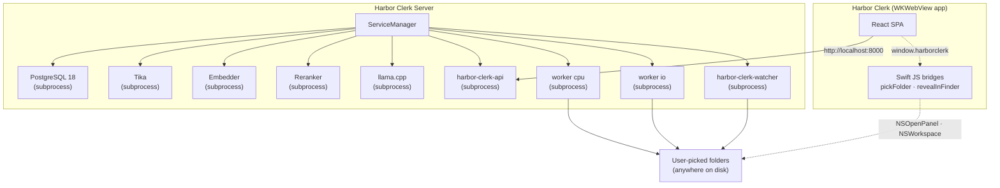
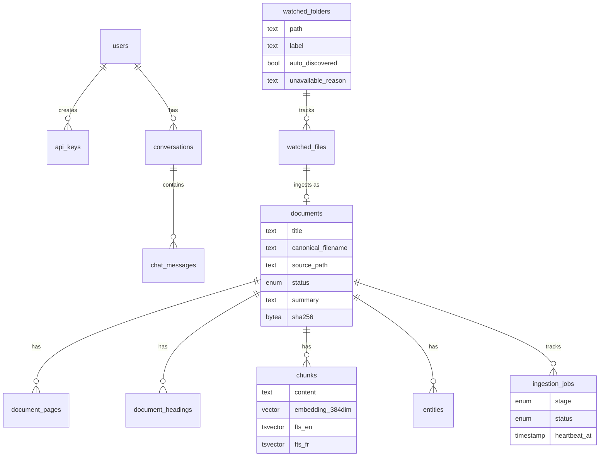
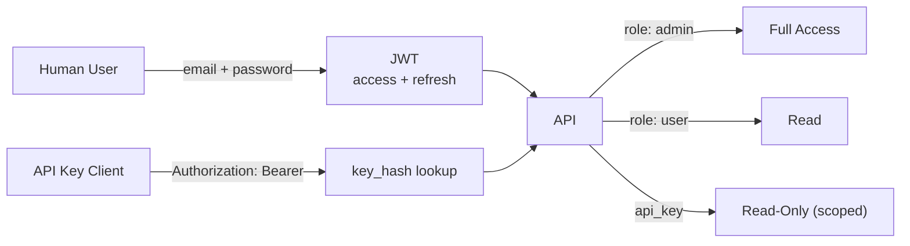

# Harbor Clerk Architecture

## System Overview

```mermaid
graph TB
    subgraph Clients
        browser["Browser / WKWebView"]
        mcp_client["MCP Client<br/>(Claude, ChatGPT, etc.)"]
        cli_agent["CLI Agent Harness<br/>harbor-clerk<br/>(OpenClaw, Claude Code, Codex)"]
    end

    subgraph Gateway
        caddy["Caddy<br/>HTTPS termination<br/>reverse proxy"]
    end

    subgraph Application
        api["FastAPI<br/>REST API + MCP + SPA"]
    end

    subgraph Watcher
        watcher["Watcher<br/>Python watchdog<br/>FSEvents / inotify / polling"]
    end

    subgraph Workers
        wio["Worker (io queue)<br/>extract, chunk, entities,<br/>summarize, finalize"]
        wcpu["Worker (cpu queue)<br/>OCR, embed"]
    end

    subgraph Data
        pg[("PostgreSQL 18<br/>+ pgvector + pg_trgm")]
        fs["Source filesystem<br/>(read in place)"]
    end

    subgraph Services
        tika["Apache Tika<br/>text extraction"]
        embedder["Embedder<br/>multilingual-e5-small<br/>384-dim"]
        reranker["Reranker<br/>cross-encoder<br/>(search re-ranking)"]
        llama["llama.cpp<br/>local LLM inference"]
    end

    browser -- "HTTPS" --> caddy
    mcp_client -- "HTTPS POST /mcp" --> caddy
    cli_agent -- "HTTPS POST /mcp<br/>request_type=cli_tool" --> caddy
    caddy --> api

    api -- "async queries" --> pg
    api -- "chat streaming" --> llama
    api -- "re-rank search hits" --> reranker
    api -- "SSE /api/jobs/stream" --> browser

    watcher -- "scan + LISTEN" --> fs
    watcher -- "enqueue ingest jobs" --> pg

    wio -- "poll jobs<br/>LISTEN/NOTIFY" --> pg
    wcpu -- "poll jobs<br/>LISTEN/NOTIFY" --> pg
    wio -- "read source" --> fs
    wcpu -- "read source" --> fs
    wio -- "extract" --> tika
    wcpu -- "OCR" --> tika
    wcpu -- "embed" --> embedder

    llama -. "tool calls<br/>via API" .-> api
```

## Client Surfaces

Three first-class ways for clients to reach the corpus, all hitting the same backend through Caddy:

| Surface | Transport | Auth | Audit `request_type` | Primary consumer |
|---|---|---|---|---|
| **Web UI** | HTTPS to React SPA + REST API | JWT (email + password) | `rest` | Humans in browser / WKWebView |
| **MCP endpoint** | `POST /mcp` (Streamable HTTP) | API key bearer or OAuth 2.1 | `mcp_tool` | Cloud LLMs — Claude, ChatGPT, Claude Desktop, Gemini CLI |
| **`harbor-clerk` CLI** | `POST /mcp` (same endpoint, JSON-RPC framing) | API key bearer | `cli_tool` | Local agent harnesses — OpenClaw, Claude Code, Codex, Aider |

The CLI is intentionally a thin shell wrapper over the same MCP transport — it does not get its own API. Two surfaces, one source of truth. Authorization scoping, rate limits, and per-key audit dashboards apply identically. The `request_type` split lets operators separate "human-driven cloud LLM traffic" from "local-agent-driven traffic" in the audit dashboard without giving them different security postures.

The CLI is opt-in (off by default). On macOS the toggle lives in **Harbor Clerk Server → Preferences**; on Docker it's `ENABLE_CLI_ACCESS=true`. See [the CLI agent skill](../skills/harbor-clerk/SKILL.md) for the harness-side surface.

## Ingestion Pipeline

Seven idempotent stages, each guarded by a row-level lock on `(doc_id, stage)`:

```mermaid
graph LR
    drop(("File appears in<br/>watched folder"))

    extract["1. extract<br/><i>io queue</i><br/>Tika / plain text"]
    ocr["2. ocr<br/><i>cpu queue</i><br/>pypdfium2 + Tesseract"]
    chunk["3. chunk<br/><i>io queue</i><br/>~1000 char, 150 overlap"]

    entities["4. entities<br/><i>io queue</i><br/>spaCy NER"]
    embed["5. embed<br/><i>cpu queue</i><br/>384-dim vectors"]
    summarize["6. summarize<br/><i>io queue</i><br/>LLM summary"]

    finalize["7. finalize<br/><i>io queue</i><br/>mark complete"]

    drop --> extract --> ocr --> chunk

    chunk --> entities & embed & summarize

    entities --> finalize
    embed --> finalize
    summarize --> finalize

    style ocr stroke-dasharray: 5 5
```

> OCR (dashed) is conditional: always for images; PDF only if extracted text is sparse; skipped for text-native formats.

## Retrieval Flow

```mermaid
graph LR
    query["Search Query"]
    fts["PostgreSQL FTS<br/>bilingual (en + fr)"]
    vec["pgvector<br/>cosine similarity"]
    merge["Normalize & merge scores<br/>OCR-confidence boost"]
    rerank["Reranker<br/>cross-encoder<br/>(top-K pool)"]
    results["Top K Results<br/>with citations"]

    query --> fts & vec
    fts --> merge
    vec --> merge
    merge --> rerank
    rerank --> results
```

> Reranker pass is optional (`reranker_enabled`, default on). When disabled or unreachable, the merged FTS+vector score is the final ordering.

## Deployment Modes

### Docker Compose (Linux / DIY)

```mermaid
graph TB
    subgraph docker["Docker Compose"]
        gw["gateway<br/>Caddy"]
        app["app<br/>FastAPI"]
        watcher["watcher<br/>(harbor-clerk-watcher)"]
        wio["worker-io"]
        wcpu["worker-cpu"]
        emb["embedder"]
        rerank["reranker"]
        pg[("postgres<br/>pgvector/pgvector:pg18")]
        minio["minio<br/>(legacy upload API)"]
        tika["tika"]
        llama["llama-server"]
    end

    host_fs["Host bind mount<br/>./data/watch"]

    gw --> app
    app --> pg & llama & rerank
    app -. "legacy uploads" .-> minio
    watcher --> pg
    watcher -- "WATCH_ROOT<br/>/data/watch" --> host_fs
    wio --> pg & tika
    wio --> host_fs
    wcpu --> pg & tika & emb
    wcpu --> host_fs
```

### macOS Native

```mermaid
graph TB
    subgraph menubar["Harbor Clerk Server<br/>(menubar agent)"]
        sm["ServiceManager"]
        pg["PostgreSQL 18<br/>(subprocess)"]
        tika["Tika<br/>(subprocess)"]
        emb["Embedder<br/>(subprocess)"]
        rerank["Reranker<br/>(subprocess)"]
        llama["llama.cpp<br/>(subprocess)"]
        api["harbor-clerk-api<br/>(subprocess)"]
        watcher["harbor-clerk-watcher<br/>(subprocess)"]
        wio["worker io<br/>(subprocess)"]
        wcpu["worker cpu<br/>(subprocess)"]
    end

    subgraph client["Harbor Clerk (WKWebView app)"]
        spa["React SPA"]
        bridge["Swift JS bridges<br/>pickFolder · revealInFinder"]
    end

    user_dirs["User-picked folders<br/>(anywhere on disk)"]

    sm --> pg & tika & emb & rerank & llama & api & watcher & wio & wcpu
    spa -- "http://localhost:8000" --> api
    spa -. "window.harborclerk" .-> bridge
    bridge -. "NSOpenPanel · NSWorkspace" .-> user_dirs
    watcher --> user_dirs
    wio --> user_dirs
    wcpu --> user_dirs
```

## Data Model (key tables)

The document model is flat: each `documents` row tracks one source file, including its current ingestion status, summary, and OCR/extraction metadata. Previous versions are not retained as a separate table — reprocessing updates the row in place.

```mermaid
erDiagram
    users ||--o{ api_keys : creates
    users ||--o{ conversations : has
    conversations ||--o{ chat_messages : contains

    watched_folders ||--o{ watched_files : tracks
    watched_files ||--o| documents : "ingests as"

    documents ||--o{ document_pages : has
    documents ||--o{ document_headings : has
    documents ||--o{ chunks : has
    documents ||--o{ entities : has
    documents ||--o{ ingestion_jobs : tracks

    chunks {
        text content
        vector embedding_384dim
        tsvector fts_en
        tsvector fts_fr
    }

    documents {
        text title
        text canonical_filename
        text source_path
        enum status
        text summary
        bytea sha256
    }

    ingestion_jobs {
        enum stage
        enum status
        timestamp heartbeat_at
    }

    watched_folders {
        text path
        text label
        bool auto_discovered
        text unavailable_reason
    }
```

> The legacy `uploads` and `upload_sessions` tables remain in the schema to keep the `POST /api/uploads/*` endpoints alive for non-interactive callers (planned email ingestion). The web UI no longer offers a direct upload affordance.

## Auth Model

```mermaid
graph LR
    human["Human User"]
    apikey["API Key Client"]

    human -- "email + password" --> jwt["JWT<br/>access + refresh"]
    apikey -- "Authorization: Bearer" --> hash["key_hash lookup"]

    jwt --> api["API"]
    hash --> api

    api -- "role: admin" --> full["Full Access"]
    api -- "role: user" --> limited["Read"]
    api -- "api_key" --> readonly["Read-Only (scoped)"]
```

- **Secret storage** — sensitive values (mail-account app passwords, future
  OAuth tokens, etc.) are encrypted in Postgres with a master key managed per
  deployment. See [secrets-and-keys.md](secrets-and-keys.md).
