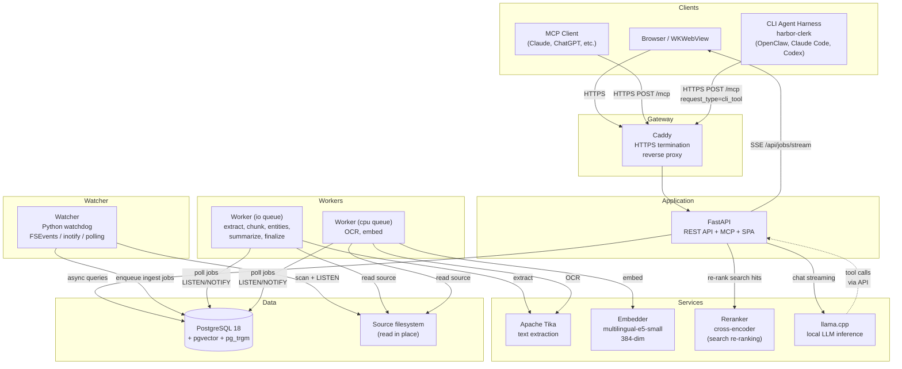
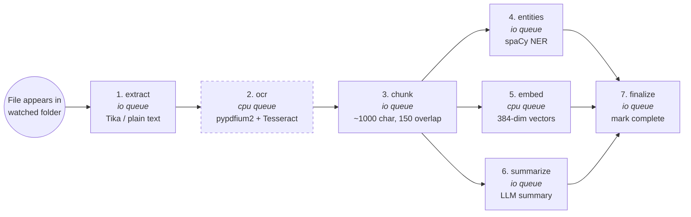
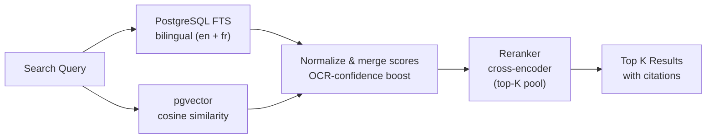
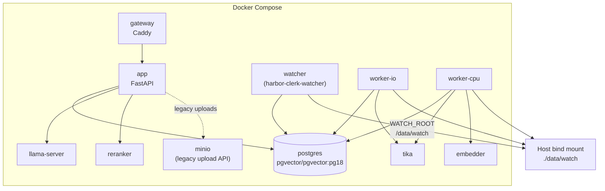
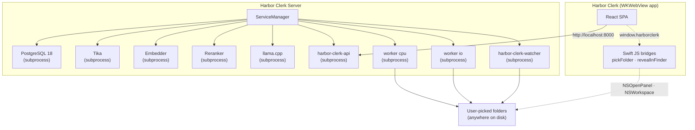
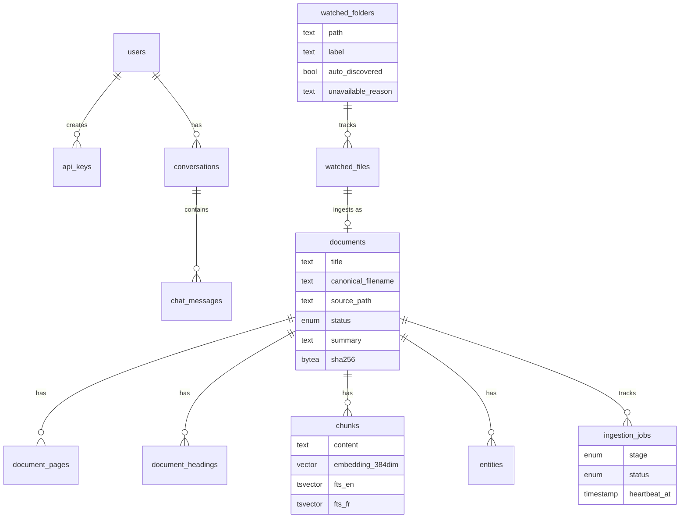
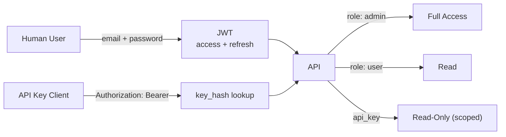

# Harbor Clerk Architecture

> [!WARNING]
> **This document is known to be stale.** An audit on 2026-07-21 (against content
> last updated 2026-05-27) found several sections describe an architecture that no
> longer exists. **Treat the code as authoritative.**
>
> Still known-wrong in the **prose and diagrams below**: the embedding model and
> dimension (now Granite-R2 / 768, not e5-small / 384), OCR's extraction path
> (pypdfium2 + Tesseract, never Tika), the macOS service list and ports, and the
> auth model's role semantics. Several shipped subsystems are missing entirely.
>
> Verified accurate: **Retrieval Flow**, **Client Surfaces**, and everything under
> **Generated reference** — those tables are derived from source and verified in
> CI, so the queue topology and the full database schema there are correct even
> where the diagrams above disagree.
>
> Tracked in [#539](https://github.com/r0shi/harborclerk/issues/539), which has the
> full findings and the plan to generate the enumerations from source so this
> cannot drift again.

## System Overview

```mermaid
graph TB
    subgraph Clients
        browser["Browser / WKWebView"]
        mcp_client["MCP Client<br/>(Claude, ChatGPT, etc.)"]
        cli_agent["CLI Agent Harness<br/>harbor-clerk<br/>(OpenClaw, Claude Code, Codex)"]
    end

    subgraph Gateway
        caddy["Caddy<br/>HTTPS termination<br/>reverse proxy"]
    end

    subgraph Application
        api["FastAPI<br/>REST API + MCP + SPA"]
    end

    subgraph Watcher
        watcher["Watcher<br/>Python watchdog<br/>FSEvents / inotify / polling"]
    end

    subgraph Workers
        wio["Worker (io queue)<br/>extract, chunk, entities,<br/>summarize, finalize"]
        wcpu["Worker (cpu queue)<br/>OCR, embed"]
    end

    subgraph Data
        pg[("PostgreSQL 18<br/>+ pgvector + pg_trgm")]
        fs["Source filesystem<br/>(read in place)"]
    end

    subgraph Services
        tika["Apache Tika<br/>text extraction"]
        embedder["Embedder<br/>multilingual-e5-small<br/>384-dim"]
        reranker["Reranker<br/>cross-encoder<br/>(search re-ranking)"]
        llama["llama.cpp<br/>local LLM inference"]
    end

    browser -- "HTTPS" --> caddy
    mcp_client -- "HTTPS POST /mcp" --> caddy
    cli_agent -- "HTTPS POST /mcp<br/>request_type=cli_tool" --> caddy
    caddy --> api

    api -- "async queries" --> pg
    api -- "chat streaming" --> llama
    api -- "re-rank search hits" --> reranker
    api -- "SSE /api/jobs/stream" --> browser

    watcher -- "scan + LISTEN" --> fs
    watcher -- "enqueue ingest jobs" --> pg

    wio -- "poll jobs<br/>LISTEN/NOTIFY" --> pg
    wcpu -- "poll jobs<br/>LISTEN/NOTIFY" --> pg
    wio -- "read source" --> fs
    wcpu -- "read source" --> fs
    wio -- "extract" --> tika
    wcpu -- "OCR" --> tika
    wcpu -- "embed" --> embedder

    llama -. "tool calls<br/>via API" .-> api
```

## Client Surfaces

Three first-class ways for clients to reach the corpus, all hitting the same backend through Caddy:

| Surface | Transport | Auth | Audit `request_type` | Primary consumer |
|---|---|---|---|---|
| **Web UI** | HTTPS to React SPA + REST API | JWT (email + password) | `rest` | Humans in browser / WKWebView |
| **MCP endpoint** | `POST /mcp` (Streamable HTTP) | API key bearer or OAuth 2.1 | `mcp_tool` | Cloud LLMs — Claude, ChatGPT, Claude Desktop, Gemini CLI |
| **`harbor-clerk` CLI** | `POST /mcp` (same endpoint, JSON-RPC framing) | API key bearer | `cli_tool` | Local agent harnesses — OpenClaw, Claude Code, Codex, Aider |

The CLI is intentionally a thin shell wrapper over the same MCP transport — it does not get its own API. Two surfaces, one source of truth. Authorization scoping, rate limits, and per-key audit dashboards apply identically. The `request_type` split lets operators separate "human-driven cloud LLM traffic" from "local-agent-driven traffic" in the audit dashboard without giving them different security postures.

The CLI is opt-in (off by default). On macOS the toggle lives in **Harbor Clerk Server → Preferences**; on Docker it's `ENABLE_CLI_ACCESS=true`. See [the CLI agent skill](../skills/harbor-clerk/SKILL.md) for the harness-side surface.

## Ingestion Pipeline

Seven idempotent stages, each guarded by a row-level lock on `(doc_id, stage)`:

```mermaid
graph LR
    drop(("File appears in<br/>watched folder"))

    extract["1. extract<br/><i>io queue</i><br/>Tika / plain text"]
    ocr["2. ocr<br/><i>cpu queue</i><br/>pypdfium2 + Tesseract"]
    chunk["3. chunk<br/><i>io queue</i><br/>~1000 char, 150 overlap"]

    entities["4. entities<br/><i>io queue</i><br/>spaCy NER"]
    embed["5. embed<br/><i>cpu queue</i><br/>384-dim vectors"]
    summarize["6. summarize<br/><i>io queue</i><br/>LLM summary"]

    finalize["7. finalize<br/><i>io queue</i><br/>mark complete"]

    drop --> extract --> ocr --> chunk

    chunk --> entities & embed & summarize

    entities --> finalize
    embed --> finalize
    summarize --> finalize

    style ocr stroke-dasharray: 5 5
```

> OCR (dashed) is conditional: always for images; PDF only if extracted text is sparse; skipped for text-native formats.

## Retrieval Flow

```mermaid
graph LR
    query["Search Query"]
    fts["PostgreSQL FTS<br/>bilingual (en + fr)"]
    vec["pgvector<br/>cosine similarity"]
    merge["Normalize & merge scores<br/>OCR-confidence boost"]
    rerank["Reranker<br/>cross-encoder<br/>(top-K pool)"]
    results["Top K Results<br/>with citations"]

    query --> fts & vec
    fts --> merge
    vec --> merge
    merge --> rerank
    rerank --> results
```

> Reranker pass is optional (`reranker_enabled`, default on). When disabled or unreachable, the merged FTS+vector score is the final ordering.

## Deployment Modes

### Docker Compose (Linux / DIY)

```mermaid
graph TB
    subgraph docker["Docker Compose"]
        gw["gateway<br/>Caddy"]
        app["app<br/>FastAPI"]
        watcher["watcher<br/>(harbor-clerk-watcher)"]
        wio["worker-io"]
        wcpu["worker-cpu"]
        emb["embedder"]
        rerank["reranker"]
        pg[("postgres<br/>pgvector/pgvector:pg18")]
        minio["minio<br/>(legacy upload API)"]
        tika["tika"]
        llama["llama-server"]
    end

    host_fs["Host bind mount<br/>./data/watch"]

    gw --> app
    app --> pg & llama & rerank
    app -. "legacy uploads" .-> minio
    watcher --> pg
    watcher -- "WATCH_ROOT<br/>/data/watch" --> host_fs
    wio --> pg & tika
    wio --> host_fs
    wcpu --> pg & tika & emb
    wcpu --> host_fs
```

### macOS Native

```mermaid
graph TB
    subgraph menubar["Harbor Clerk Server<br/>(menubar agent)"]
        sm["ServiceManager"]
        pg["PostgreSQL 18<br/>(subprocess)"]
        tika["Tika<br/>(subprocess)"]
        emb["Embedder<br/>(subprocess)"]
        rerank["Reranker<br/>(subprocess)"]
        llama["llama.cpp<br/>(subprocess)"]
        api["harbor-clerk-api<br/>(subprocess)"]
        watcher["harbor-clerk-watcher<br/>(subprocess)"]
        wio["worker io<br/>(subprocess)"]
        wcpu["worker cpu<br/>(subprocess)"]
    end

    subgraph client["Harbor Clerk (WKWebView app)"]
        spa["React SPA"]
        bridge["Swift JS bridges<br/>pickFolder · revealInFinder"]
    end

    user_dirs["User-picked folders<br/>(anywhere on disk)"]

    sm --> pg & tika & emb & rerank & llama & api & watcher & wio & wcpu
    spa -- "http://localhost:8000" --> api
    spa -. "window.harborclerk" .-> bridge
    bridge -. "NSOpenPanel · NSWorkspace" .-> user_dirs
    watcher --> user_dirs
    wio --> user_dirs
    wcpu --> user_dirs
```

## Data Model (key tables)

The document model is flat: each `documents` row tracks one source file, including its current ingestion status, summary, and OCR/extraction metadata. Previous versions are not retained as a separate table — reprocessing updates the row in place.

```mermaid
erDiagram
    users ||--o{ api_keys : creates
    users ||--o{ conversations : has
    conversations ||--o{ chat_messages : contains

    watched_folders ||--o{ watched_files : tracks
    watched_files ||--o| documents : "ingests as"

    documents ||--o{ document_pages : has
    documents ||--o{ document_headings : has
    documents ||--o{ chunks : has
    documents ||--o{ entities : has
    documents ||--o{ ingestion_jobs : tracks

    chunks {
        text content
        vector embedding_384dim
        tsvector fts_en
        tsvector fts_fr
    }

    documents {
        text title
        text canonical_filename
        text source_path
        enum status
        text summary
        bytea sha256
    }

    ingestion_jobs {
        enum stage
        enum status
        timestamp heartbeat_at
    }

    watched_folders {
        text path
        text label
        bool auto_discovered
        text unavailable_reason
    }
```

> The legacy `uploads` and `upload_sessions` tables remain in the schema to keep the `POST /api/uploads/*` endpoints alive for non-interactive callers (planned email ingestion). The web UI no longer offers a direct upload affordance.

## Auth Model

```mermaid
graph LR
    human["Human User"]
    apikey["API Key Client"]

    human -- "email + password" --> jwt["JWT<br/>access + refresh"]
    apikey -- "Authorization: Bearer" --> hash["key_hash lookup"]

    jwt --> api["API"]
    hash --> api

    api -- "role: admin" --> full["Full Access"]
    api -- "role: user" --> limited["Read"]
    api -- "api_key" --> readonly["Read-Only (scoped)"]
```

- **Secret storage** — sensitive values (mail-account app passwords, future
  OAuth tokens, etc.) are encrypted in Postgres with a master key managed per
  deployment. See [secrets-and-keys.md](secrets-and-keys.md).

## Generated reference

The tables below are generated from source by `scripts/gen_docs` and verified in
CI. They cannot drift; the prose and diagrams above are hand-maintained and can.

### Ingestion pipeline stages

<!-- BEGIN GENERATED: pipeline-stages -->
<!-- Do not edit by hand. Regenerate: uv run python -m scripts.gen_docs -->

**7 stages across 3 queues** (`cpu`, `io`, `llm`).

| Stage | Queue | Timeout | Role |
|---|---|---|---|
| `extract` | `io` | 600s | sequential (1 of 3) |
| `ocr` | `cpu` | 7200s | sequential (2 of 3) |
| `chunk` | `io` | 1200s | sequential (3 of 3) |
| `entities` | `io` | 900s | parallel — gates `finalize` |
| `embed` | `cpu` | 3600s | parallel — gates `finalize` |
| `summarize` | `llm` | 900s | background — does **not** gate `finalize` |
| `finalize` | `io` | 600s | fan-in |

Queue subscriptions:

- `cpu` — `ocr`, `embed`
- `io` — `extract`, `chunk`, `entities`, `finalize`
- `llm` — `summarize`
<!-- END GENERATED: pipeline-stages -->

### Docker Compose services

<!-- BEGIN GENERATED: compose-services -->
<!-- Do not edit by hand. Regenerate: uv run python -m scripts.gen_docs -->

**12 services.** Generated from `docker-compose.yml`.

| Service | Image | Role |
|---|---|---|
| `app` | built from `docker/app.Dockerfile` | — |
| `embedder` | built from `docker/embedder.Dockerfile` | — |
| `gateway` | `caddy:2-alpine` | — |
| `llama-server` | `ghcr.io/ggml-org/llama.cpp:server` | — |
| `minio` | `minio/minio:latest` | `server` |
| `postgres` | `pgvector/pgvector:pg18` | — |
| `reranker` | built from `docker/reranker.Dockerfile` | — |
| `tika` | `apache/tika:latest` | — |
| `watcher` | built from `docker/app.Dockerfile` | `harbor-clerk-watcher` |
| `worker-cpu` | built from `docker/app.Dockerfile` | worker — queues: `cpu` |
| `worker-io` | built from `docker/app.Dockerfile` | worker — queues: `io` |
| `worker-llm` | built from `docker/app.Dockerfile` | worker — queues: `llm` |
<!-- END GENERATED: compose-services -->

### Database tables

<!-- BEGIN GENERATED: db-tables -->
<!-- Do not edit by hand. Regenerate: uv run python -m scripts.gen_docs -->

**29 tables.** Generated from SQLAlchemy metadata.

### Documents & ingestion

| Table | Key columns |
|---|---|
| `chunks` | `chunk_id` (PK), `doc_id` → `documents`, `fts_en` (tsvector), `fts_fr` (tsvector), `embedding` (vector) |
| `document_headings` | `heading_id` (PK), `doc_id` → `documents` |
| `document_links` | `link_id` (PK), `src_doc_id` → `documents`, `target_doc_id` → `documents` |
| `document_pages` | `page_id` (PK), `doc_id` → `documents` |
| `documents` | `doc_id` (PK), `topic_id` → `corpus_topics`, `email_parent_doc_id` → `documents` |
| `entities` | `entity_id` (PK), `chunk_id` → `chunks`, `doc_id` → `documents` |
| `ingestion_jobs` | `job_id` (PK), `doc_id` → `documents` |

### Watched folders

| Table | Key columns |
|---|---|
| `watched_files` | `file_id` (PK), `folder_id` → `watched_folders`, `doc_id` → `documents` |
| `watched_folders` | `folder_id` (PK) |

### Email (IMAP)

| Table | Key columns |
|---|---|
| `imap_command_log` | `log_id` (PK), `account_id` → `mail_accounts` |
| `mail_accounts` | `account_id` (PK) |
| `watched_labels` | `label_id` (PK), `account_id` → `mail_accounts` |
| `watched_messages` | `message_pk` (PK), `label_id` → `watched_labels`, `email_doc_id` → `documents` |

### Chat & research

| Table | Key columns |
|---|---|
| `chat_messages` | `message_id` (PK), `conversation_id` → `conversations` |
| `conversations` | `conversation_id` (PK), `user_id` → `users` |
| `research_state` | `conversation_id` (PK) |

### Users & auth

| Table | Key columns |
|---|---|
| `api_keys` | `key_id` (PK) |
| `oauth_clients` | `client_id` (PK) |
| `oauth_codes` | `code_id` (PK), `client_id` → `oauth_clients`, `user_id` → `users` |
| `oauth_tokens` | `token_id` (PK), `client_id` → `oauth_clients`, `user_id` → `users` |
| `users` | `user_id` (PK) |

### Corpus analysis

| Table | Key columns |
|---|---|
| `corpus_topics` | `topic_id` (PK) |
| `corpus_topics_meta` | `id` (PK) |

### Operations & audit

| Table | Key columns |
|---|---|
| `api_request_log` | `request_id` (PK), `api_key_id` → `api_keys` |
| `audit_log` | `audit_id` (PK), `user_id` → `users`, `api_key_id` → `api_keys` |
| `model_settings` | `model_id` (PK) |
| `schema_metadata` | `key` (PK) |

### Legacy uploads

| Table | Key columns |
|---|---|
| `upload_sessions` | `session_id` (PK), `user_id` → `users` |
| `uploads` | `upload_id` (PK), `user_id` → `users`, `doc_id` → `documents`, `session_id` → `upload_sessions` |
<!-- END GENERATED: db-tables -->

### REST API

<!-- BEGIN GENERATED: rest-endpoints -->
<!-- Do not edit by hand. Regenerate: uv run python -m scripts.gen_docs -->

**141 operations**, 84 of them access-gated. Generated from the FastAPI OpenAPI schema; the Access column is derived from each route's dependency tree.

### `api-keys`

| Method | Path | Access | Summary |
|---|---|---|---|
| `GET` | `/api/api-keys` | **admin** | List Api Keys |
| `POST` | `/api/api-keys` | **admin** | Create Api Key |
| `POST` | `/api/api-keys/scope-preview` | **admin** | Scope Preview Adhoc |
| `DELETE` | `/api/api-keys/{key_id}` | **admin** | Delete Api Key |
| `PATCH` | `/api/api-keys/{key_id}` | **admin** | Patch Api Key |
| `GET` | `/api/api-keys/{key_id}/scope-preview` | **admin** | Scope Preview |
| `DELETE` | `/api/api-keys/{key_id}/usage` | **admin** | Purge Key Usage |
| `GET` | `/api/api-keys/{key_id}/usage` | **admin** | Get Key Usage |
| `GET` | `/api/api-keys/{key_id}/usage/requests` | **admin** | Get Key Requests |
| `GET` | `/api/api-keys/{key_id}/usage/timeline` | **admin** | Get Key Timeline |

### `auth`

| Method | Path | Access | Summary |
|---|---|---|---|
| `POST` | `/api/auth/login` | — | Login |
| `POST` | `/api/auth/logout` | — | Logout |
| `POST` | `/api/auth/refresh` | — | Refresh |
| `GET` | `/api/me` | — | Get Me |
| `POST` | `/api/me/password` | — | Change Password |
| `PATCH` | `/api/me/preferences` | — | Update Preferences |

### `chat`

| Method | Path | Access | Summary |
|---|---|---|---|
| `GET` | `/api/chat/conversations` | — | List Conversations |
| `POST` | `/api/chat/conversations` | **human only** | Create Conversation |
| `DELETE` | `/api/chat/conversations/{conv_id}` | **human only** | Delete Conversation |
| `GET` | `/api/chat/conversations/{conv_id}` | — | Get Conversation |
| `GET` | `/api/chat/conversations/{conv_id}/export` | — | Export Conversation |
| `POST` | `/api/chat/conversations/{conv_id}/messages` | **human only** | Send Message |
| `GET` | `/api/chat/models` | — | List Available Models |
| `PUT` | `/api/chat/models/deactivate` | **admin** | Deactivate Model |
| `GET` | `/api/chat/models/download-progress` | — | Download Progress Stream |
| `GET` | `/api/chat/models/orphaned` | — | List Orphaned Models |
| `DELETE` | `/api/chat/models/orphaned/{filename}` | **admin** | Remove Orphaned Model |
| `GET` | `/api/chat/models/status` | — | Llm Status |
| `GET` | `/api/chat/models/summary-afm` | — | Get Summary Force Afm |
| `PUT` | `/api/chat/models/summary-afm` | **admin** | Toggle Summary Force Afm |
| `GET` | `/api/chat/models/yarn` | — | Get Yarn Status |
| `PUT` | `/api/chat/models/yarn` | **admin** | Toggle Yarn |
| `DELETE` | `/api/chat/models/{model_id}` | **admin** | Remove Model |
| `PUT` | `/api/chat/models/{model_id}/activate` | **admin** | Activate Model |
| `POST` | `/api/chat/models/{model_id}/download` | **admin** | Start Model Download |

### `documents`

| Method | Path | Access | Summary |
|---|---|---|---|
| `GET` | `/api/docs` | — | List Documents |
| `GET` | `/api/docs/entities/autocomplete` | — | Entity Autocomplete |
| `GET` | `/api/docs/entities/top` | — | Top Entities |
| `GET` | `/api/docs/filters` | — | Document Filters |
| `GET` | `/api/docs/overview` | — | Corpus Overview |
| `DELETE` | `/api/docs/{doc_id}` | **admin** | Delete Document |
| `GET` | `/api/docs/{doc_id}` | — | Get Document |
| `POST` | `/api/docs/{doc_id}/cancel` | **admin** | Cancel Processing |
| `GET` | `/api/docs/{doc_id}/content` | — | Get Document Content |
| `GET` | `/api/docs/{doc_id}/download` | — | Download Document |
| `GET` | `/api/docs/{doc_id}/entities` | — | Get Document Entities |
| `GET` | `/api/docs/{doc_id}/outline` | — | Get Document Outline |
| `GET` | `/api/docs/{doc_id}/related` | — | Find Related Documents |
| `POST` | `/api/docs/{doc_id}/reprocess` | **admin** | Reprocess Document |
| `POST` | `/api/docs/{doc_id}/resummarize` | **admin** | Resummarize Document |

### `jobs`

| Method | Path | Access | Summary |
|---|---|---|---|
| `GET` | `/api/jobs/active` | — | Active Jobs |
| `GET` | `/api/jobs/snapshot` | — | Jobs Snapshot |
| `GET` | `/api/jobs/stream` | — | Job Stream |

### `languages`

| Method | Path | Access | Summary |
|---|---|---|---|
| `GET` | `/api/languages` | **human only** | List Languages |
| `DELETE` | `/api/languages/{lang_code}` | **admin** | Remove Language Completely |
| `POST` | `/api/languages/{lang_code}/install` | **admin** | Install Language Tools |
| `DELETE` | `/api/languages/{lang_code}/install/{tool_name}` | **admin** | Remove Language Tool |

### `mail`

| Method | Path | Access | Summary |
|---|---|---|---|
| `GET` | `/api/mail/accounts` | **admin** | List Mail Accounts |
| `POST` | `/api/mail/accounts` | **admin** | Create Mail Account |
| `DELETE` | `/api/mail/accounts/{account_id}` | **admin** | Delete Mail Account |
| `POST` | `/api/mail/accounts/{account_id}/test` | **admin** | Test Mail Account |
| `GET` | `/api/mail/labels` | **admin** | List Watched Labels |
| `POST` | `/api/mail/labels` | **admin** | Create Watched Label |
| `DELETE` | `/api/mail/labels/{label_id}` | **admin** | Delete Watched Label |
| `POST` | `/api/mail/labels/{label_id}/rescan` | **admin** | Rescan Label |

### `oauth`

| Method | Path | Access | Summary |
|---|---|---|---|
| `GET` | `/.well-known/oauth-authorization-server` | — | Oauth Authorization Server |
| `GET` | `/.well-known/oauth-protected-resource` | — | Oauth Protected Resource |
| `GET` | `/api/integrations/connections` | **admin** | List Connections |
| `DELETE` | `/api/integrations/connections/{client_id}` | **admin** | Delete Connection |
| `GET` | `/api/integrations/settings` | **admin** | Get Integration Settings |
| `PUT` | `/api/integrations/settings` | **admin** | Update Integration Settings |
| `GET` | `/oauth/authorize` | — | Oauth Authorize Get |
| `POST` | `/oauth/authorize` | — | Oauth Authorize Post |
| `POST` | `/oauth/register` | — | Oauth Register |
| `POST` | `/oauth/revoke` | — | Oauth Revoke |
| `POST` | `/oauth/token` | — | Oauth Token |

### `research`

| Method | Path | Access | Summary |
|---|---|---|---|
| `GET` | `/api/research` | — | List Research |
| `POST` | `/api/research` | **human only** | Start Research |
| `GET` | `/api/research/active` | — | Check Active |
| `DELETE` | `/api/research/{conv_id}` | **human only** | Delete Research |
| `GET` | `/api/research/{conv_id}` | — | Get Research |
| `POST` | `/api/research/{conv_id}/resume` | **human only** | Resume Research |

### `search`

| Method | Path | Access | Summary |
|---|---|---|---|
| `POST` | `/api/passages/read` | — | Read Passages |
| `POST` | `/api/search` | — | Search |
| `POST` | `/api/search/find-all` | — | Search Find All |

### `setup`

| Method | Path | Access | Summary |
|---|---|---|---|
| `POST` | `/api/setup` | — | Setup |

### `stats`

| Method | Path | Access | Summary |
|---|---|---|---|
| `GET` | `/api/docs/{doc_id}/stats` | — | Document Stats |
| `GET` | `/api/stats` | — | Corpus Stats |
| `GET` | `/api/stats/clusters` | — | Document Clusters |
| `GET` | `/api/stats/entity-network` | — | Entity Network |
| `GET` | `/api/stats/timeline` | — | Document Timeline |
| `GET` | `/api/stats/topics` | — | Topic Clusters |

### `system`

| Method | Path | Access | Summary |
|---|---|---|---|
| `POST` | `/api/system/clear-queue` | **admin** | Clear Queue |
| `POST` | `/api/system/clear-redundant-summary-backlog` | **admin** | Clear Redundant Summary Backlog |
| `POST` | `/api/system/delete-all-documents` | **admin** | Delete All Documents |
| `GET` | `/api/system/health` | — | Health Check |
| `GET` | `/api/system/logs` | **admin** | List Logs |
| `GET` | `/api/system/ping` | — | Ping |
| `POST` | `/api/system/purge-run` | **admin** | Purge Run |
| `GET` | `/api/system/rate-limit-settings` | **admin** | Get Rate Limit Settings |
| `PUT` | `/api/system/rate-limit-settings` | **admin** | Update Rate Limit Settings |
| `POST` | `/api/system/reaper-run` | **admin** | Reaper Run |
| `POST` | `/api/system/recompute-topics` | **admin** | Recompute Topics Endpoint |
| `POST` | `/api/system/repair-completed-statuses` | **admin** | Repair Completed Statuses |
| `POST` | `/api/system/reprocess-all` | **admin** | Reprocess All |
| `POST` | `/api/system/reprocess-all-skip-summarize` | **admin** | Reprocess All Skip Summarize |
| `POST` | `/api/system/resummarize-all` | **admin** | Resummarize All |
| `GET` | `/api/system/retrieval-settings` | **admin** | Get Retrieval Settings |
| `PUT` | `/api/system/retrieval-settings` | **admin** | Update Retrieval Settings |
| `POST` | `/api/system/run-migrations` | **admin** | Run Migrations |
| `GET` | `/api/system/setup-status` | — | Setup Status |
| `GET` | `/api/system/stats` | **admin** | System Stats |
| `GET` | `/api/system/status-summary` | **admin** | Status Summary |
| `GET` | `/api/system/summary-backlog` | **admin** | Get Summary Backlog |

### `uploads`

| Method | Path | Access | Summary |
|---|---|---|---|
| `GET` | `/api/uploads` | **human only** | List Uploads |
| `POST` | `/api/uploads` | **human only** | Upload Files |
| `POST` | `/api/uploads/confirm` | **human only** | Confirm Upload |
| `POST` | `/api/uploads/confirm-batch` | **human only** | Confirm Upload Batch |
| `POST` | `/api/uploads/sessions` | **human only** | Create Session |
| `DELETE` | `/api/uploads/sessions/{session_id}` | **human only** | Cancel Session |
| `GET` | `/api/uploads/sessions/{session_id}` | **human only** | Get Upload Session |
| `POST` | `/api/uploads/sessions/{session_id}/confirm` | **human only** | Confirm Session |
| `POST` | `/api/uploads/sessions/{session_id}/files` | **human only** | Upload File To Session |
| `GET` | `/api/uploads/sessions/{session_id}/resume` | **human only** | Get Resume Info |

### `users`

| Method | Path | Access | Summary |
|---|---|---|---|
| `GET` | `/api/users` | **admin** | List Users |
| `POST` | `/api/users` | **admin** | Create User |
| `DELETE` | `/api/users/{user_id}` | **admin** | Delete User |
| `GET` | `/api/users/{user_id}` | **admin** | Get User |
| `PATCH` | `/api/users/{user_id}` | **admin** | Update User |

### `watch`

| Method | Path | Access | Summary |
|---|---|---|---|
| `GET` | `/api/watch/allowed-extensions` | — | Allowed Extensions |
| `GET` | `/api/watch/folders` | — | List Folders |
| `POST` | `/api/watch/folders` | **human only** | Create Folder |
| `GET` | `/api/watch/folders/stream` | — | Folder Progress Stream |
| `DELETE` | `/api/watch/folders/{folder_id}` | **human only** | Delete Folder |
| `PATCH` | `/api/watch/folders/{folder_id}` | **human only** | Patch Folder |
| `GET` | `/api/watch/folders/{folder_id}/progress` | — | Get Folder Progress |
| `POST` | `/api/watch/folders/{folder_id}/rescan` | **human only** | Rescan Folder |
| `POST` | `/api/watch/ingest` | **human only** | Ingest File |
| `POST` | `/api/watch/remove` | **human only** | Remove File |
| `POST` | `/api/watch/rename` | **human only** | Rename File |
| `GET` | `/api/watch/system` | — | Get System |
<!-- END GENERATED: rest-endpoints -->

### CLI subcommands

<!-- BEGIN GENERATED: cli-commands -->
<!-- Do not edit by hand. Regenerate: uv run python -m scripts.gen_docs -->

**19 subcommands**, mirroring the MCP tool surface. Enable with `ENABLE_CLI_ACCESS=true` (Docker) or the macOS Preferences toggle.

| Command | Description |
|---|---|
| `harbor-clerk batch-search` | harbor-clerk batch-search — run multiple searches in one call |
| `harbor-clerk corpus-overview` | harbor-clerk corpus-overview — corpus-level statistics and document list |
| `harbor-clerk document-outline` | harbor-clerk document-outline — heading tree, page count, and chunk count |
| `harbor-clerk documents-by-date` | harbor-clerk documents-by-date — date-sorted document lookup |
| `harbor-clerk entity-cooccurrence` | harbor-clerk entity-cooccurrence — entities that appear alongside a given entity |
| `harbor-clerk entity-overview` | harbor-clerk entity-overview — aggregate entity statistics (corpus or per-doc) |
| `harbor-clerk entity-search` | harbor-clerk entity-search — search named entities by name or type |
| `harbor-clerk expand-context` | harbor-clerk expand-context — read N chunks before and after a target chunk |
| `harbor-clerk find-all` | harbor-clerk find-all - enumerate matching documents |
| `harbor-clerk find-related` | harbor-clerk find-related — find documents similar to a given document |
| `harbor-clerk get-document` | harbor-clerk get-document — document metadata, status, and pipeline jobs |
| `harbor-clerk ingest-status` | harbor-clerk ingest-status — per-stage ingestion progress for one document |
| `harbor-clerk list-recent` | harbor-clerk list-recent — recently updated documents |
| `harbor-clerk read-document` | harbor-clerk read-document — read a document's text by page range |
| `harbor-clerk read-passages` | harbor-clerk read-passages — fetch full passage text by chunk ID |
| `harbor-clerk reprocess` | harbor-clerk reprocess — re-run the full ingestion pipeline for a document |
| `harbor-clerk search` | harbor-clerk search — hybrid FTS + vector search |
| `harbor-clerk system-health` | harbor-clerk system-health — daemon + storage health snapshot |
| `harbor-clerk verify-identifier` | harbor-clerk verify-identifier — verify an identifier resolves to one document |
<!-- END GENERATED: cli-commands -->
